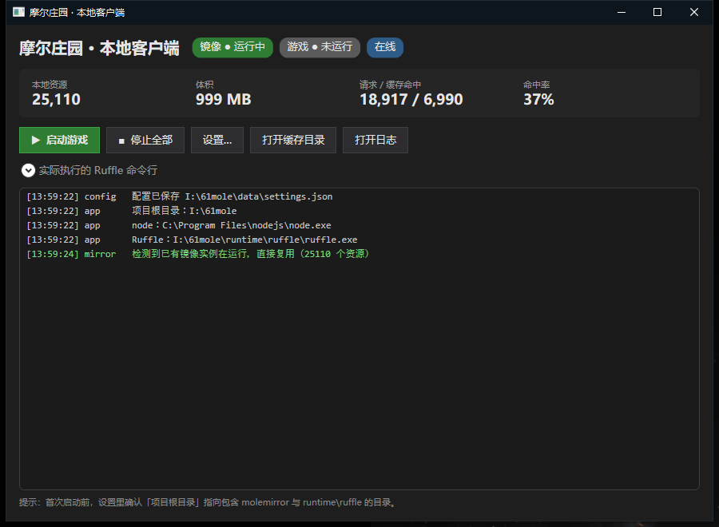

# Phase 3 · 本地客户端启动器

> .NET 7 + WPF 桌面壳。负责：自动启停本地镜像、注入 Ruffle 参数、设置界面、托盘与日志。
> 位置：`launcher/MoleLauncher/`；发布产物：`launcher/publish/`。

---

## 一、为什么参数是"注入"而不是"改客户端"

启动器**不修改任何官方文件**。它做的全部事情是：

1. 把 `HTTP_PROXY` 指向本地镜像（`molemirror`），让引擎从本地取资源；
2. 给 Ruffle 传入一组命令行开关，把「客户端以为自己在哪里」伪装成官网。

这与 Phase 0 的结论一致：**官方 Ruffle 桌面版的命令行开关已经覆盖了 MoleRuffle 改源码所做的全部事情**，
因此不需要编译引擎、也不需要补丁。

---

## 二、项目结构

```
launcher/
├── build-launcher.ps1              发布脚本（框架依赖 / 自包含 / 打包 zip）
└── MoleLauncher/
    ├── MoleLauncher.csproj
    ├── App.xaml(.cs)               入口；含 --print-command 调试模式
    ├── MainWindow.xaml(.cs)        主界面：状态、统计、启停、日志
    ├── SettingsWindow.xaml(.cs)    设置：路径 / 端口 / 模式 / 画面 / 高级
    ├── Models/AppSettings.cs
    └── Services/
        ├── PathResolver.cs         自动探测项目根 / node / Ruffle
        ├── SettingsService.cs      配置读写（项目内优先）
        ├── LogService.cs           应用内日志 + 落盘
        ├── MirrorService.cs        molemirror 进程生命周期与 /__status 轮询
        └── RuffleService.cs        参数装配与 Ruffle 进程管理
```

---

## 三、界面



- **状态徽章**：镜像运行中 / 游戏运行中 / 在线或离线模式
- **统计**：本地资源数、体积、请求与缓存命中数、命中率（2 秒轮询 `/__status`）
- **按钮**：启动游戏、停止全部、设置、打开缓存目录、打开日志
- **命令行预览**：可折叠，展示实际会执行的完整 Ruffle 命令行（便于排查）
- **日志**：按级别着色（OK 绿 / WRN 黄 / ERR 红），同时写入 `logs\launcher.log`
- **托盘**：关闭窗口最小化到托盘，游戏继续运行；托盘菜单可显示主窗口 / 启动 / 停止 / 退出

---

## 四、Ruffle 参数逐项说明

`RuffleService.BuildArguments()` 里的每一项都对应 Phase 0 实测到的一个具体问题：

| 参数 | 为什么必须有 |
|---|---|
| `--spoof-url http://mole.61.com/Client.swf` | 破域名守卫。`Client.swf` 检测到自己不在官网会 `navigateToURL("http://mole.61.com")` 把自己弹走 |
| `--base http://mole.61.com/` | `version/` `resource/` `config/` `dll/` 都是相对路径，必须给基准 |
| `--config <root>\data\config` | ⚠️ **必须显式指定**。默认的 `%LOCALAPPDATA%\ruffle` 创建会被拒（`os error 5`），Ruffle 会**静默退出且不打印任何东西** |
| `--tcp-connections allow` | 游戏用 `flash.net.Socket` 连官方服务器，默认策略会拦 |
| `--socket-allow ×3` | 白名单：登录服 `1863`、游戏服 `1865`、`Server.xml` 声明的 `3200` |
| `--player-version 32` | 客户端按 plugin 版本判断兼容性 |
| `--scale show-all --force-scale` | 客户端自设 `NoScale`，不强制会在小窗口溢出 |
| `--proxy` + `HTTP_PROXY` | 双保险：命令行参数与标准环境变量都设，确保资源走本地镜像 |
| `--no-gui` | 隐藏 Ruffle 菜单栏 |

### 客观验证方式

启动器提供 `--print-command`，不启 UI，只打印将要执行的命令行：

```powershell
.\launcher\publish\MoleLauncher.exe --print-command
```

实测输出（节选）：

```
Ruffle 命令行:
  "I:\61mole\runtime\ruffle\ruffle.exe" http://mole.61.com/Client.swf --base http://mole.61.com/
  --spoof-url http://mole.61.com/Client.swf --config I:\61mole\data\config
  --cache-directory I:\61mole\data\cache --storage disk --save-directory I:\61mole\data\SharedObjects
  --tcp-connections allow --socket-allow 123.206.131.236:1863 --socket-allow 123.206.131.236:1865
  --socket-allow 123.206.131.63:3200 --player-version 32 --scale show-all --force-scale
  --width 1000 --height 620 --proxy http://127.0.0.1:8899 --no-gui
```

与 `docs/spike-0.md` 里手工验证过的参数集**逐项一致**。

> 注：`--print-command` 以前其实会顺手建一次主窗口（XAML 的 `StartupUri` 在 `OnStartup` 返回后才处理），
> 日志里能看到"托盘图标已创建"。现已改为在 `App.OnStartup` 里显式建窗口，这些模式**真的不启 UI** 了。

### 其它命令行模式

| 开关 | 作用 |
|---|---|
| `--print-command` | 只打印 Ruffle 命令行后退出 |
| `--open-logs` / `--open-cache` | 用资源管理器打开 `logs\` / `cache\`（同「打开目录」按钮同一条代码路径），成功与否写进 `logs\launcher.log`，便于脚本断言 |
| `--play` | 窗口起来后自动「启动镜像 + 启动游戏」，配计划任务可开机直进游戏 |
| `--download-ruffle` | 下载 Ruffle 到 `runtime\ruffle\` |

「打开目录」这条路径前后踩了两个坑，都实测复现过：

**坑一：交给 ShellExecute 解析目录 → 「拒绝访问」**

```
[Warn] app 打开目录失败：An error occurred trying to start process 'I:\61mole\logs' … 拒绝访问。
```

explorer.exe 明明在跑，所以不是"没有外壳"；是 `ShellExecute` 解析 `open` 动词这一步返回了 Win32 5。

**坑二：改成直接起 explorer.exe → 0xc0000142 弹窗**

```
---------------------------
explorer.exe - 应用程序错误
---------------------------
应用程序无法正常启动(0xc0000142)。请单击"确定"关闭应用程序。
```

`Process.Start` 本身**不抛异常**，所以最初那版验证脚本把它记成了"成功"——实际上
子进程在 DLL 初始化阶段就死了（0xc0000142 = `STATUS_DLL_INIT_FAILED`）。
系统日志里能查到证据，注意**启动器起的和 pwsh 起的表现不一样**：

```powershell
Get-WinEvent -FilterHashtable @{LogName='System'; ProviderName='Application Popup'} |
    Where-Object Message -match 'explorer' | Select-Object TimeCreated, Message
```

```
00:41:11 / 00:41:50 / 00:42:16 / 00:51:57 / 00:52:00   ← 启动器起的，全挂
（同期 pwsh 直接起的都正常，窗口能出来）
```

也就是说"**能不能新起一个 explorer.exe 进程，取决于父进程上下文**"，
不是启动器代码本身的问题，但代码必须扛得住。

**现在的实现**（`Services/ShellOpen.cs`）：**提权与不提权走两条路**，逐个试，并且**只在确认到窗口时才算成功**
（调用没抛异常 ≠ 用户看到窗口 —— 实测 `runas` 返回 0 却什么都没开）。全部失败时：把路径复制到剪贴板，
并弹一个说明框告诉用户粘到资源管理器地址栏。

| 顺序 | 方式 | 是否需要新 explorer 进程 | 本机实测（提权启动器） |
|---|---|---|---|
| ①（仅提权时） | `runas /trustlevel:0x20000 "explorer.exe …"` | 是（受限令牌） | 退出码 0，但**没开窗** |
| ②（仅提权时） | WMI `Win32_Process.Create` 起 explorer | 是 | **拒绝访问** |
| ③ | `Shell.Application` COM 的 `Explore` | 否 | 调用成功，**没开窗** |
| ④ | `cmd.exe /c start "" "<目录>"` | 否 | 进程起来了，**没开窗** |
| ⑤ | `ShellExecute`（`FileName = 目录`） | 否 | **Win32 5 拒绝访问** |
| ⑥ | `explorer.exe "<目录>"`（CreateProcess） | **是** | **0xc0000142**（就是那个"应用程序错误"弹窗） |

> 同一个功能在 `--open-logs` 验证模式里还会遇到"确认不到窗口"的假象：
> `Shell.Application.Windows()` 需要有消息泵才枚举得到窗口，而无 UI 模式没有消息泵。
> 现在等待期间会用 `Dispatcher.PushFrame` 抽空处理消息，所以**确认结果在两种模式下都可信**了。

### 真正的环境原因：这台机器 UAC 是关的，于是启动器必然提权

实测把两边身份直接打出来对比（`ShellOpen` 会把身份写进日志的 `〔…〕` 里）：

| 进程 | 令牌 | 打开目录的结果 |
|---|---|---|
| 排查用的 pwsh | `admin=False`（受限令牌） | 六种方式**都能开窗** |
| **启动器**（从桌面启动） | `admin=True`，`UAC关闭=True` | **六种方式全失败** |

```
EnableLUA = 0        # UAC 关闭
```

UAC 关闭时，登录令牌不再被过滤 —— **从桌面启动的一切程序都带完整管理员令牌**。
而 Windows 在这种（没有 UAC 代理的）状态下，不允许提权进程把"打开目录"的请求交给资源管理器：
这正是 Win32 5、`0xc0000142`、WMI 拒绝访问、"无法访问指定设备、路径或文件"这四种现象的共同来源。
换句话说：**这不是路径权限问题，也不是启动器代码写法问题，而是"提权进程 + UAC 关闭"的组合限制**，
本项目在用户态绕不过去（`runas /trustlevel` 已经是官方降权手段，实测仍无效）。

> 启动器自己的清单是 **`asInvoker`**（没有 `requireAdministrator`）——
> 它提权只是因为父进程（桌面/UAC 关闭环境）就是提权的。

**所以失败时必须给用户出路**：现在的行为是
① 日志里写清六种方式的结局和当前令牌；② 把目录路径**复制到剪贴板**；
③ 弹框说明原因并让用户粘到资源管理器地址栏。不再是"只报拒绝访问"或一个吓人的系统错误框。

> 想在启动器里真正"点开目录"，可选的下一步：在启动器内做一个日志/缓存浏览面板（自己读目录，不经过 shell），
> 或者把 Windows 的 UAC 重新打开。两条都超出本次改动范围，记在这里备选。

### 运行期状态：logs\*.pid

| 文件 | 谁写 | 用途 |
|---|---|---|
| `launcher.pid` | 启动器（启动时写、退出时删） | `run.ps1 -Status` 判断启动器是否还在 |
| `molemirror.pid` / `ruffle.pid` | `run.ps1` | 同样的判断依据；`run.ps1 -Stop` 会一并清理 |

> 以前 `launcher.pid` 没人写也没人删，出现过指向早已退出进程的陈旧 pid（实测 26076）；
> 现在启动器自己维护，`-Status` 也会明确标出"已退出，pid 文件陈旧"。

### 日志降噪

Ruffle 每个重复帧标签都会打一条 WARN，实测一次 55 分钟游玩产生 **1120 条**
`Movie clip N: Duplicated frame label`，占 `launcher.log` 全文 85%，把 404、AVM2 异常、
字体回退这些真问题全埋了。启动器的日志管道（`Services/RuffleLogFilter.cs`）会把它们折叠成一行汇总：

```
[Info ] ruffle   已折叠 140 条 "Duplicated frame label" 告警（对运行无影响，可用 tools\filter-ruffle-log.js 还原原文）
```

同时把 `Unknown device font` 变成一次性提示，指向 `tools\install-xp-simsun.ps1`（见 `docs/fonts.md`）。

---

## 五、AppData / %TEMP% 写入被拒：两次判断，两次都不准

这一节记录一个**我改了两次才搞对**的结论。留着它是因为过程本身有教学价值。

### 5.1 第一次观测

首次运行时配置**没有写成功**，而且因为当时用的是空的 `catch {}`，完全没有痕迹。
把静默捕获改成记录日志后，真因立刻显现：

```
配置保存失败：Access to the path 'C:\Users\iyyh\AppData\Roaming\MoleLauncher' is denied.
```

**当时的结论**：这台机器在 `%APPDATA%` / `%LOCALAPPDATA%` 下新建目录会被拒，
并与 Ruffle 的 `Failed to create configuration directory (os error 5)` 归为同一根因。

### 5.2 第一次更正（矫枉过正）

复测时用 **PowerShell** 与 **.NET `Directory.CreateDirectory`** 都能创建该目录，
CFA（受控文件夹访问）也是关闭的，ACL 正常。于是我推翻了自己：

> 那次是偶发（可能是杀软对新建未签名 exe 首次写 AppData 的瞬时拦截），不是持续性策略。

**这个更正仍然是错的** —— 因为我用 PowerShell 去"验证"，而 PowerShell 是受信任的签名程序，
它本来就不在拦截范围内。**用不受限的工具去验证受限主体的行为，方法本身就不成立。**

### 5.3 第二次更正：真正的原因

第三轮做 `--download-ruffle` 时，出现了**稳定复现**的同类错误：

```
下载失败：Access to the path 'C:\Users\iyyh\AppData\Local\Temp\ruffle-<guid>.zip' is denied.
```

于是做了一组对照实验：

| 主体 | 写 `%TEMP%` | 写项目内目录 | 说明 |
|---|---|---|---|
| **MoleLauncher.exe**（未签名、自编译） | ❌ **Access denied** | ✅ 正常 | 复现 2/2 |
| `cmd.exe`（系统签名） | ✅ 正常 | — | |
| `node.exe`（第三方签名） | ✅ 正常 | — | |
| PowerShell（签名） | ✅ 正常 | — | |

同时确认：CFA = 0、ASR 规则为空、只装了 Windows Defender、`%TEMP%` 的 ACL 里用户是 FullControl。

**结论**：这不是机器级的目录策略，而是**针对"未签名的自编译二进制"写用户 profile 目录的拦截**
（Defender 或其它安全软件的启发式，签名程序不受影响）。
所以它**既不是机器策略、也不是偶发**——是**只对这个二进制稳定复现**。

### 5.4 处理方式

不跟它对抗，直接绕开——**所有临时/配置/状态文件一律放项目内**：

| 用途 | 位置 |
|---|---|
| 启动器配置 | `<root>\data\settings.json`（AppData 仅作兜底） |
| Ruffle 的 `--config` | `<root>\data\config` |
| 下载暂存 | `<root>\data\temp`（**刻意不用 `%TEMP%`**） |
| 缓存 / 日志 | `<root>\cache`、`<root>\logs` |

改完后下载功能实测通过（19.3 秒，25.76 MB，暂存零残留）。

这与"本地/便携客户端"的定位也一致：不依赖用户 profile 的权限状态，换机器直接可用。

### 5.5 与 Ruffle `os error 5` 的关系

Ruffle 的情况是**稳定复现**的：它每次启动都报
`Failed to create configuration directory (os error 5)`，
而 PowerShell 手工创建同一个 `%LOCALAPPDATA%\ruffle` 却成功。

以 5.3 的结论看，这很可能是**同一类拦截**（Ruffle 是第三方未签名的独立 exe）。
但这一条我没有做更深入的验证，只能说"与 5.3 的现象一致"，**不做确定性断言**。

无论根因如何，`--config` 显式指定目录**仍然是必需的**（启动器里已硬编码）。

### 5.6 教训

1. **一次观测不能推成机器级结论**（第一次犯的错）；
2. **验证工具的权限/信任级别必须与被验证主体一致**（第二次犯的错）——
   拿 PowerShell 去证明"这个目录可以写"，对 MoleLauncher.exe 毫无意义；
3. 在 Windows 上排查"Access denied"时，**先分清是 ACL、策略、还是按主体的安全软件拦截**。

### 5.7 附带修掉的一处同类问题

脚本 `build-launcher.ps1` 一开始完全无法运行，报 `The term '//' is not recognized` 与
`The string is missing the terminator`。原因有两个：

1. 我误用了 C# 的 `//` 注释（PowerShell 是 `#`）；
2. **更隐蔽的一条**：PowerShell 5.1 读取 `.ps1` 时若无 BOM 会按 **ANSI** 解码，
   脚本里的中文变成乱码字节，其中某些序列被当成引号，导致解析崩溃。

修法：脚本保存为**带 BOM 的 UTF-8**。

> **这个坑在本项目里踩了四次**（另有 PowerShell 的 `>` 重定向默认写 UTF-16LE、
> 内联 Node 脚本里的 `$` 被 PowerShell 吃掉、以及用 `edit` 工具改完 `.ps1` 后 BOM 丢失）。
> 凡是跨 PowerShell / Node / 编辑器传递含中文的脚本，都要显式检查编码与 BOM。
> 现在的做法：改完 `.ps1` 一律用 `UTF8Encoding($true)` 重写一遍，并用
> `Parser::ParseFile` 做语法检查——**语法检查能立刻抓出 BOM 丢失**。

### 5.8 发布脚本现在会自己挡掉"exe 被占用"

`dotnet publish` 无法覆盖正在运行的 `MoleLauncher.exe`，但它的报错只有
"发布失败"，不给原因。打包流程因此卡过一次，排查花了几分钟。

现在 `build-launcher.ps1` 会：

1. 发布前检测并结束正在运行的启动器实例；
2. 若仍然失败，在异常信息里直接提示「publish 目录下的文件被占用」。

---

## 六、其他设计要点

### 6.1 先探测已有实例，再决定要不要 spawn

启动时先请求一次 `/__status`：

- 有响应 → **复用**该实例（`_attached = true`），不再另起一个然后因端口占用而失败；
- 无响应 → 才真正拉起 node 进程。

停止时若只是复用，**不会去杀别人的进程**，只解除绑定。

实测日志：

```
[Ok   ] mirror   检测到已有镜像实例在运行，直接复用（25110 个资源）
```

### 6.2 路径探测顺序：项目内优先

`PathResolver` 从可执行文件目录**向上最多 8 层**查找含 `molemirror\index.js` 的目录作为项目根。
这样无论从 `bin\Debug\...` 还是 `publish\` 运行都能找对。

Ruffle 的探测顺序：配置 → `<项目根>\runtime\ruffle\ruffle.exe` → PATH → `%LOCALAPPDATA%\Ruffle\`。
**项目内自带即可完全自足**，不依赖目标机装了什么。

### 6.3 Ruffle 缺失时的一键下载

设置窗口里「下载…」按钮会：

1. 请求 GitHub Releases API 找最新的 `windows-x86_64.zip`；
2. 下载并解压到 `<项目根>\runtime\ruffle\`；
3. 自动把 `ruffle.exe` 路径填进配置。

这样分发包**不必自带第三方二进制**，用户也不必手工找。

---

## 七、构建与发布

```powershell
# 框架依赖（约 200 KB，目标机需 .NET 7 桌面运行时）
powershell -ExecutionPolicy Bypass -File launcher\build-launcher.ps1

# 自包含单文件（目标机无需任何运行时，体积约 150 MB）
powershell -ExecutionPolicy Bypass -File launcher\build-launcher.ps1 -SelfContained

# 额外打包 zip
powershell -ExecutionPolicy Bypass -File launcher\build-launcher.ps1 -Zip
```

> 执行策略若限制脚本运行，需要 `-ExecutionPolicy Bypass`。

发布目录里同时生成 `启动摩尔庄园.bat` 便捷入口。

---

## 八、验证状态

| 项 | 状态 |
|---|---|
| `dotnet build -c Release` | ✅ **0 警告 0 错误** |
| 启动器启动、窗口正常 | ✅ 标题「摩尔庄园 · 本地客户端」 |
| 项目根 / node / Ruffle 路径探测 | ✅ 三项全部正确 |
| 配置持久化 | ✅ 落到 `I:\61mole\data\settings.json` |
| 复用已运行的镜像实例 | ✅ 日志确认 |
| `--print-command` 参数正确性 | ✅ 与 Phase 0 验证集逐项一致 |
| `dotnet publish`（框架依赖） | ✅ 产物正常，从 `publish\` 运行路径探测正确 |
| 界面渲染 | ✅ 截图确认 |
| 托盘图标 | ⚠️ **未实测**（代码已写，需人工点一次） |
| 实际点击「启动游戏」 | ⚠️ **未实测**（会开第二个游戏窗口；参数已客观验证） |
| 下载 Ruffle 按钮 | ⚠️ **未实测**（需联网走一次） |
| 自包含发布 | ⚠️ **未实测**（脚本已备） |

---

## 九、已知限制

1. 托盘图标用的是通用应用图标（`SystemIcons.Application`），没有专门设计 `.ico`。
2. 下载 Ruffle 走 GitHub API，国内网络可能需要代理。
3. 修改「项目根目录」后配置文件仍留在原位置，不会自动迁移。
4. 启动器只管镜像与引擎生命周期，**不介入登录**——账号密码在客户端自己的登录框里输入。
